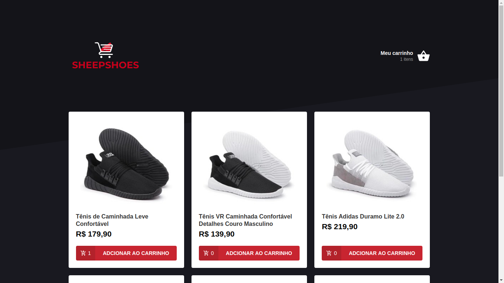
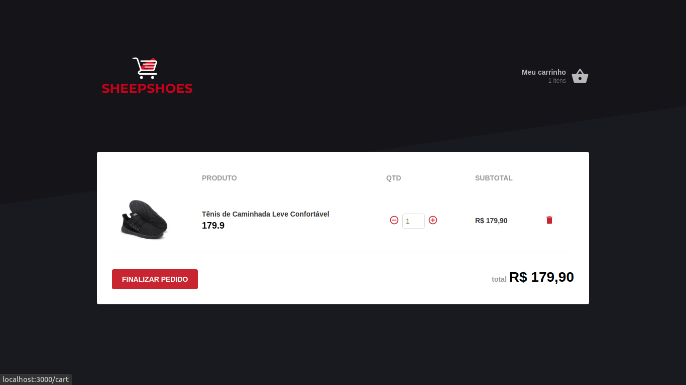

# SheepShoes | Choice & Run!:running: :dash:   

 

## Scripts

In the project directory, you can run:

### `yarn start`

Runs the app in the development mode. 
Open [http://localhost:3000](http://localhost:3000) to view it in the browser.

### `json-server server.json -p 3333`
Backend runs in 3333

